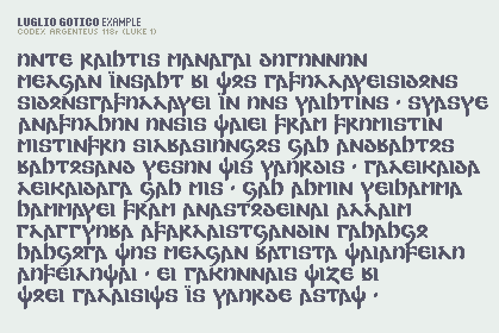
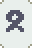

# Luglio Gotico
<picture>
	<source media="(prefers-color-scheme: dark)" srcset="assets/stairnons-rinnand_dark.png" width="654">
	
</picture>

*The stars flow like the river flows ·*

**Luglio Gotico** is a proportional pixel font created for the **Gothic alphabet** which was used for writing the extinct Germanic language "Gothic" in the Codex Argenteus and other works some 1500 years ago.

This font is intended for the Gothic language. It might not be useful for typing other languages or to imitate other alphabets.

**[Download luglio-gotico.zip](https://github.com/HeyMyian/luglio-gotico/releases/latest/download/luglio-gotico.zip)** from the latest release.

## Example

Text from the Codex Argenteus 118r.

## Usage

### Font size

The native font size is **16px**. The ascent height is 14px. The total height (ascent + descent) is 20px.

### Typing

Luglio Gotico can be typed by using the common transliterations in the Latin alphabet, see also the Wikipedia page for the [Gothic alphabet](https://en.wikipedia.org/wiki/Gothic_alphabet). Note the following custom use of symbols:

- The `𐍈` symbol for `hv` can be typed with `ƕ` or `v`.
- The `𐌸` symbol for `th` can be typed with `þ` or `c`.
- The `𐍁` symbol for the numeral &ldquo;90&rdquo; can be typed with `y`.
- The `𐍊` symbol for the numeral &ldquo;900&rdquo; can be typed with `0` (zero).
- Uppercase and lowercase letters are identical.
- Vowels with diacritics `áāēíōū` are identical to the according base vowels. This is for ease of copy-pasting text that contains diacritics. Exception is `ï`, which has its own glyph.
- Punctuation `.,;?!` is all rendered as middot `·`.
- The font contains the following additional symbols which do not exist in the source material: `()[]`, as well as `dash`, `en-dash`, and `em-dash`.
- Furthermore supported is the use of the native Gothic Unicode symbols in the following range: `U+10330–U+1034F`.

## Glyphs

Non-standard transliterations are marked with an asterisk `*`.

| Glyph                                  | Unicode | Letter | Number | Special |
| -------------------------------------- | ------- | -------| ------ | ------- |
|         | 𐌰       | <kbd>a</kbd> | <kbd>1</kbd> | |
|         | 𐌱       | <kbd>b</kbd> | <kbd>2</kbd> | |
|         | 𐌲       | <kbd>g</kbd> | <kbd>3</kbd> | |
|         | 𐌳       | <kbd>d</kbd> | <kbd>4</kbd> | |
|         | 𐌴       | <kbd>e</kbd> | <kbd>5</kbd> | |
|         | 𐌵       | <kbd>q</kbd> | <kbd>6</kbd> | |
|         | 𐌶       | <kbd>z</kbd> | <kbd>7</kbd> | |
|         | 𐌷       | <kbd>h</kbd> | <kbd>8</kbd> | |
|         | 𐌸       | <kbd>c</kbd> * | <kbd>9</kbd> | <kbd>þ</kbd> |
|         | 𐌹       | <kbd>i</kbd> | | |
|   |         |  | | <kbd>ï</kbd> |
|         | 𐌺       | <kbd>k</kbd> | | |
|         | 𐌻       | <kbd>l</kbd> | | |
|         | 𐌼       | <kbd>m</kbd> | | |
|         | 𐌽       | <kbd>n</kbd> | | |
|         | 𐌾       | <kbd>j</kbd> | | |
|         | 𐌿       | <kbd>u</kbd> | | |
|         | 𐍀       | <kbd>p</kbd> | | |
|         | 𐍁       | <kbd>y</kbd> * | | |
|         | 𐍂       | <kbd>r</kbd> | | |
|         | 𐍃       | <kbd>s</kbd> | | |
|         | 𐍄       | <kbd>t</kbd> | | |
|         | 𐍅       | <kbd>w</kbd> | | |
|         | 𐍆       | <kbd>f</kbd> | | |
|         | 𐍇       | <kbd>x</kbd> | | |
|         | 𐍈       | <kbd>v</kbd> * |  | <kbd>ƕ</kbd> |
|         | 𐍉       | <kbd>o</kbd> | | |
|         | 𐍊       |  | <kbd>0</kbd> * | |
|     | ·       |  |  |  <kbd>.</kbd> <kbd>,</kbd> <kbd>;</kbd> <kbd>·</kbd> <kbd>?</kbd> <kbd>!</kbd>
|     |         |  |  |  <kbd>:</kbd> |
|   |         |  |  |  <kbd>(</kbd> |
|   |         |  |  |  <kbd>)</kbd> |
|    |         |  |  |  <kbd>[</kbd> |
|    |         |   |  | <kbd>]</kbd> |
|      |         |   |  | <kbd>-</kbd> (hyphen) |
|   |         |   |  | <kbd>–</kbd> (en-dash) |
|   |         |  |  | <kbd>—</kbd> (em-dash) |

## Credits

- The font was designed by [Myian](https://github.com/HeyMyian).
- The font file was created using YellowAfterlife's [Pixel font converter](https://yellowafterlife.itch.io/pixelfont).